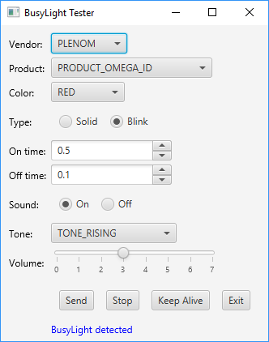

# busylightapi

The busylightapi project is an open-source application programming interface (API) and graphical user interface (GUI) tester for BusyLight devices by [Plenom A/S](https://www.busylight.com/en_us/). This is a platform-independent solution implemented in Java 8.

The BusyLightAPI class is a generic API for any external interface. It depends on platform-specific runtime libraries from the hid4java project (see *hid4java\src\main\resources*). The BusyLightGUI class is a sample UI that uses the BusyLightAPI class to control the device.

### Requirements

* Java SE Development Kit 8
* Eclipse IDE
* hid4java Maven project ([link](https://github.com/gary-rowe/hid4java))

### Installation and Configuration

* Clone the hid4java Maven project and import it into Eclipse as en existing Maven project
* Clone the busylightapi project and import it into Eclipse as an existing Java Project
  * Add the hid4java Maven project as a project in the Java build path
  * Add the hid4java resources folder as a source folder in the Java build path
  * Export the src and resources folders in the order and export tab of the Java build path
  
### Building

* From the busylightapi project, export BusyLightGUI as a runnable JAR file
  * Select *Package required libraries into generated JAR*
  * Name it busylight.jar

### Running

* Plug BusyLight device into a USB port on your computer
* Run the busylightapi GUI: ```user@yourmachine:~$  java -jar busylight.jar```
* Attempts to auto-detect a connected BusyLight and selects *Vendor* and *Product* automatically

<p align="left">
	
</p>

<p align="left">
	
</p>

Options:

* *Vendor* - vendor of device
* *Product* - BusyLight devices
* *Color* - color of light
* *Type* - solid or blinking
* *On time* - duration light is on (for blinking only)
* *Off time* - duration light is off (for blinking only)
* *Sound* - future use
* *Send* - send the message to the light
* *Stop* - send a stop message to the light
* *Exit* - exit the tester UI


