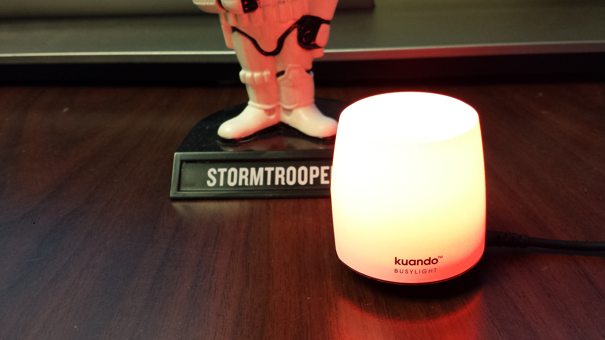

# busylightapi

The busylightapi project is an open-source application programming interface (API) for BusyLight devices by [Plenom A/S](https://www.busylight.com/en_us/). This is a platform-independent solution implemented in Java 8.

The BusyLightAPI class is a generic API for any external interface. It depends on platform-specific runtime libraries from the hid4java project (see *hid4java\src\main\resources*).

### BusyLightGUI

The BusyLightGUI program is a sample GUI that uses the BusyLightAPI class to control the device. This is a sample test program that demonstrates the various capabilities of the BusyLight.

### BusyLightAD

The BusyLightAD program is a GUI for integrating a BusyLight with the ACE Direct platform. BusyLightAD requires the ACE Direct agent portal URL to establish a connection to ACE Direct. The BusyLight AD GUI periodically queries ACE Direct for the latest agent status. This is the original interface between the BusyLight and ACE Direct.

### lightserver

The lightserver program is a GUI for integrating a BusyLight with the ACE Direct platform. It provides a RESTful interface via localhost only, to the ACE Direct agent portal. It is only available locally on the agent's desktop computer. When the agent status changes, the portal makes RESTful calls to the lightserver. The ACE Direct portal makes the initial connection to lightserver, and all requests to localhost will work after that. This is an improvement on the BusyLightAD program, since a unique URL is not required. The lightserver application is the current and preferred interface between the BusyLight and ACE Direct.

### Requirements

* Java SE Development Kit 8
* Eclipse IDE
* hid4java Maven project ([link](https://github.com/gary-rowe/hid4java))
* busylightapi GitHub project
* JAX-RS 2.0 libraries: https://jersey.github.io/download.html
  * aopalliance-repackaged-2.5.0-b32.jar
  * hk2-api-2.5.0-b32.jar
  * hk2-locator-2.5.0-b32.jar
  * hk2-utils-2.5.0-b32.jar
  * javassist-3.20.0-GA.jar
  * javax.annotation-api-1.2.jar
  * javax.inject-2.5.0-b32.jar
  * javax.servlet-api-3.0.1.jar
  * javax.ws.rs-api-2.0.1.jar
  * jaxb-api-2.2.7.jar
  * jersey-client.jar
  * jersey-common.jar
  * jersey-container-servlet.jar
  * jersey-container-servlet-core.jar
  * jersey-guava-2.25.1.jar
  * jersey-media-jaxb.jar
  * jersey-server.jar
  * jsonassert-1.3.0.jar
  * jsonassert-1.3.0-sources.jar
  * json-org.jar
  * org.osgi.core-4.2.0.jar
  * osgi-resource-locator-1.0.1.jar
  * persistence-api-1.0.jar
  * validation-api-1.1.0.Final.jar

### Installation and Configuration

* Clone the hid4java Maven project and import it into Eclipse as en existing Maven project
* Clone the busylightapi project and import it into Eclipse as an existing Java Project
  * Add the hid4java Maven project as a project in the Java build path
  * Add the hid4java resources folder as a source folder in the Java build path
  * Export the src and resources folders in the order and export tab of the Java build path

### Building

* From the busylightapi project, export BusyLightGUI, BusyLightAD, or lightserver as a runnable JAR file
  * Select *Package required libraries into generated JAR*
  * Name it BusyLightGUI.jar, BusyLightAD.jar, or lightserver.jar
* If you just want the executables, see the _exe_ folder

### Running

* Plug BusyLight device into a USB port on your computer
* Run
	* ```user@yourmachine:~$  java -jar BusyLightGUI.jar```
	* ```user@yourmachine:~$  java -jar BusyLightAD.jar```
	* ```user@yourmachine:~$  java -jar lightserver.jar```


